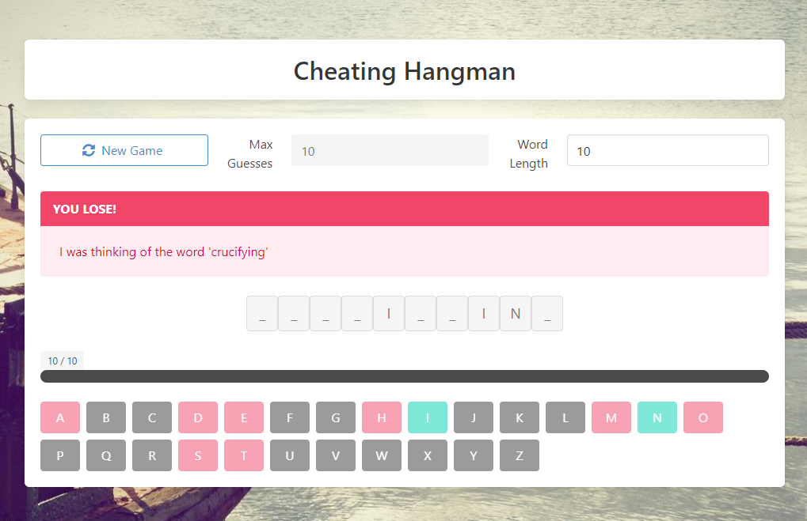

# Cheating Hangman



A web implementation using the SAFE stack of the cheating hangman program from the book _Think Like a Programmer: An Introduction to Creative Problem Solving_ by V. Anton Spraul.

## Install pre-requisites

-   [.NET Core SDK](https://www.microsoft.com/net/download) 5.0 or higher
-   [Node LTS](https://nodejs.org/en/download/)

## Starting the application

Before you run the project **for the first time only** you must install dotnet "local tools" with this command:

```bash
dotnet tool restore
```

To concurrently run the server and the client components in watch mode use the following command:

```bash
dotnet run
```

Then open `http://localhost:8080` in your browser.
